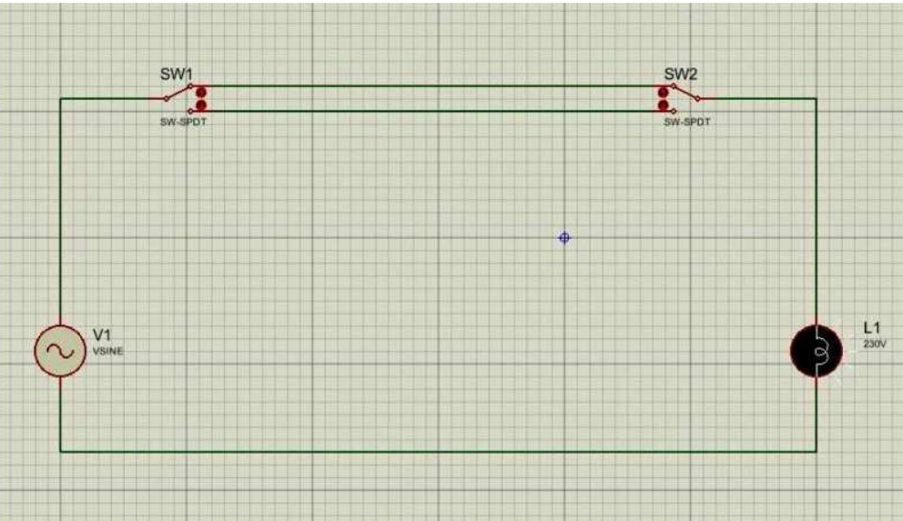
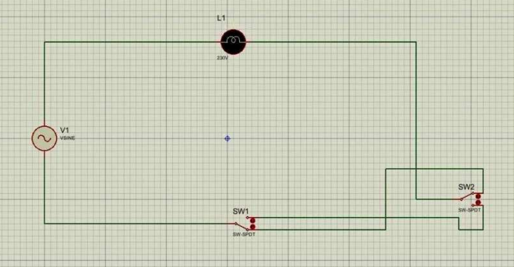
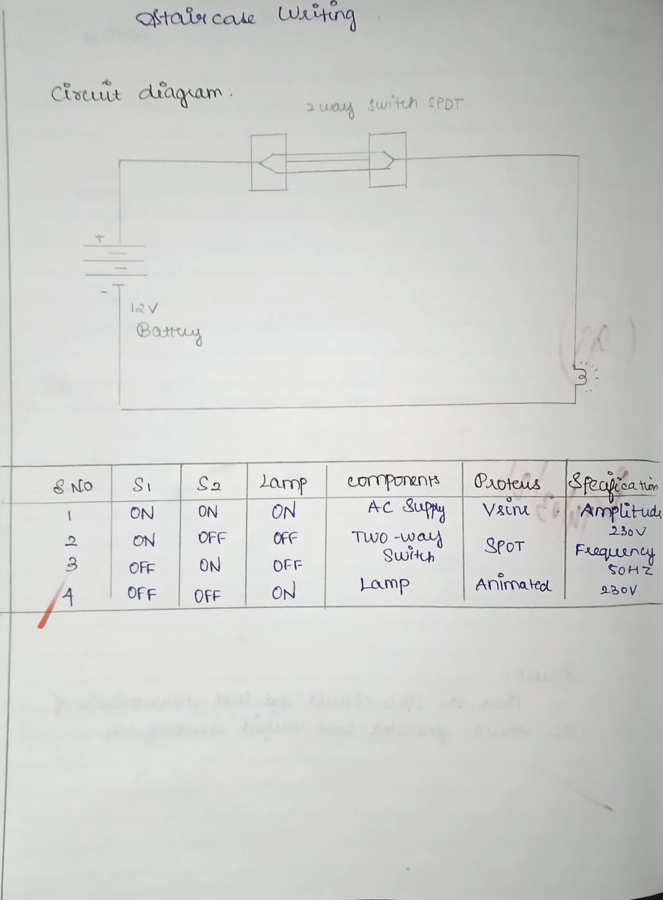

# EXP-3
EXPT NO: 3				STAIR CASE WIRING                     

 
AIM
 To control the status of the given lamp by using two–way switches. 
APPARATUS REQUIRED:

S. No.
Name of the apparatus	
Range / Type	
Quantity

1	Incandescent Lamp	60W	1 No.
2	Lamp Holder	Pendent Type	1 No.
3	SPDT Switch	230V,5A	2 Nos
4	Wires	1/18”	As per requirement
5	P.V.C Pipe	1/4"	As per requirement
6	Wooden Board	-	1 No.
7	Round block	-	1 No.

Theory:
•	A two way switch is installed near the first step of the stairs. The other two way switch is installed at the upper part where the stair ends.
•	The light point is provided between first and last stair at an adequate location and height if the light is switched on by the lower switch. It can be switched off by the switch at the top or vice versa.
•	The circuit can be used at the places like bed room where the person may  not  have  to  travel for switching off the light to the place from where the light is switched on.
•	Two  numbers  of  two-way  switches  are  used  for  the  purpose.  The supply is given to the switch at the short circuited terminals.
•	The  connection  to  the  light  point  is  taken  from  the  similar  short circuited  terminal  of  the   second  switch.   Order  two  independent terminals of each circuit are connected through  cables 
PROCEDURE
•  Place the accessories on the wiring board as per the circuit diagram.
•  Place the P.V.C pipe and insert two wires into the P.V.C pipe.
•	Take one wire connect one end to the phase side and other end to the middle point of SPDT switch 1
•  Upper point of SPDT switch 1 is connected to the lower point of SPDT
switch2.
•  Lower point of SPDT 1 is connected to the upper point SPDT switch2.
•	Another wire taken through a P.V.C pipe and middle point of SPDT switch 2 is connected to one end of the lamp holder.
•  Another end of lamp holder is connected to neutral line.
•  Screw the accessories on the board and switch on the supply.
•  Circuit is tested for all possible combination of switch positions.

Direct connection: CIRCUIT DIAGRAM:

Tabulation:1

	
Cross connection: CIRCUIT DIAGRAM:

Tabulation:2

RESULT:
Thus the staircase wiring is connected and tested.
